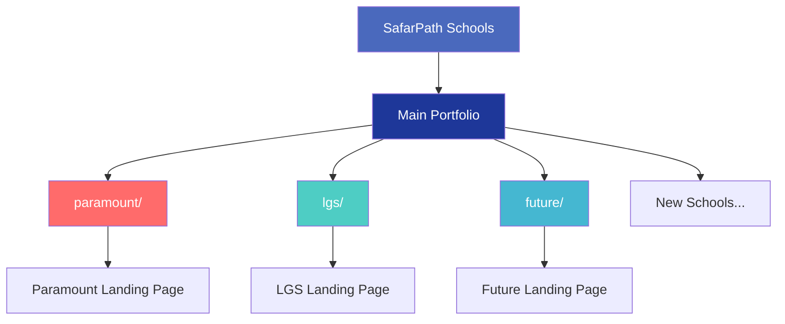
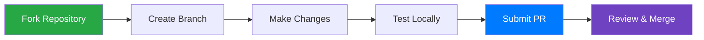

# 🏫 SafarPath Schools Portfolio


A stunning 3D cosmic-themed portfolio showcase for educational institutions, featuring interactive school landing pages with natural and classic design elements.

## 🌟 Features

- **🎨 3D Cosmic Design** - Immersive universe theme with floating planets
- **🚀 Interactive Animations** - Mouse-based 3D tilting and parallax effects
- **📱 Fully Responsive** - Optimized for all devices
- **🌌 Natural Elements** - Stars, nebulas, and celestial animations
- **🎯 Easy Navigation** - Intuitive school portfolio access

## 🏫 Available Schools

| School | Description | Link |
|--------|-------------|------|
| **Paramount Academy** | Prestigious institution shaping future leaders | [`/paramount/`](https://safarpath.github.io/school/paramount/) |
| **LGS Constellation** | Academic brilliance and dream realization | [`/lgs/`](https://safarpath.github.io/school/lgs/) |
| **Future Institute** | Innovative learning environment for thinkers | [`/future/`](https://safarpath.github.io/school/future/) |

## 🗂️ Project Structure




## 🛠️ Technology Stack


## 📊 Repository Stats


## 🎨 Design Features

| Feature | Description |
|---------|-------------|
| **3D Transform Effects** | CSS 3D transformations and perspective |
| **Cosmic Background** | Animated stars and nebula clouds |
| **Smooth Animations** | CSS keyframes and transitions |
| **Glass Morphism** | Backdrop filters and transparency |
| **Responsive Grid** | CSS Grid with auto-fit layout |

## 🌐 Live Demo

Visit the main portfolio: **[https://safarpath.github.io/school/](https://safarpath.github.io/school/)**

## 📱 Mobile Support


## 🔧 Development

### Local Development
1. Clone the repository:
```bash
git clone https://github.com/SafarPath/school.git
```

2. Open `index.html` in your browser

### File Structure
```
school/
├── index.html              # Main portfolio page
├── paramount/              # Paramount School
│   └── index.html          # School landing page
├── lgs/                    # LGS School  
│   └── index.html          # School landing page
├── future/                 # Future Institute
│   └── index.html          # School landing page
└── README.md              # Project documentation
```

## 🤝 Contributing

We welcome contributions! Please feel free to submit issues and enhancement requests.

### Contribution Workflow


## 📄 License

This project is open source and available under the [MIT License](LICENSE).

## 🏆 Badges

<div align="center">


</div>

## 📞 Contact

For questions or suggestions, please open an issue or reach out to the maintainers.

---

<div align="center">

**⭐ Star this repository if you find it helpful!**

*"Education is the most powerful weapon which you can use to change the world." - Nelson Mandela*

</div>
